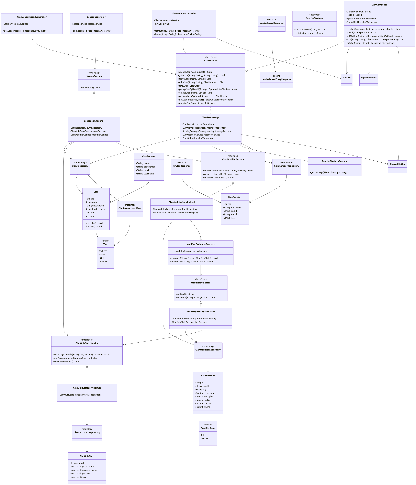
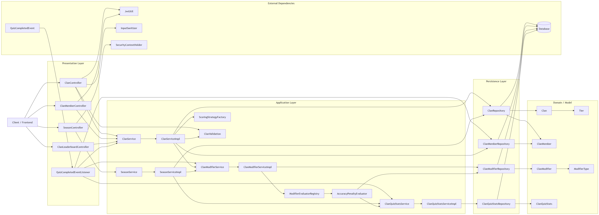
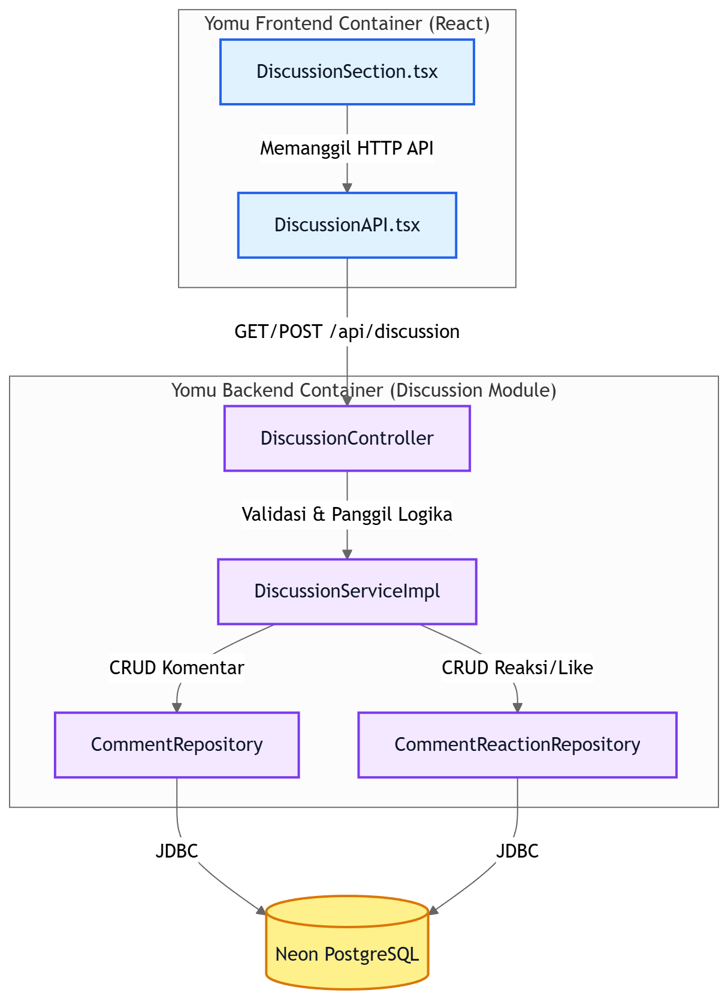
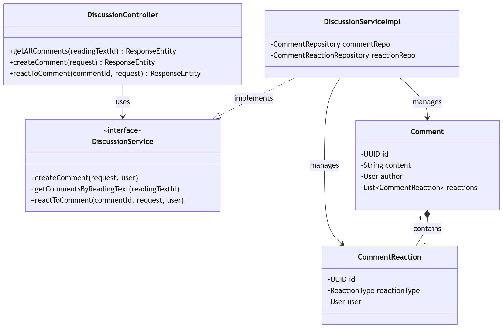
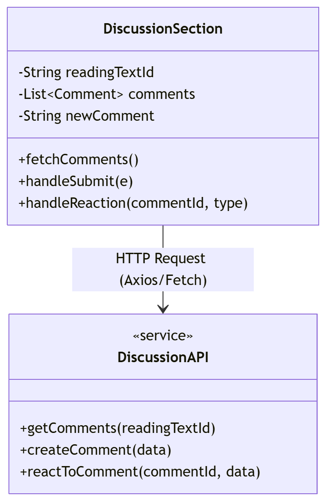

# Module-09-B-Kelompok

<b>1. The current architecture of the group YOMU (A09), the context, container and deployment diagram.</b>

## Context Diagram

## Container Diagram

## Deployment Diagram

<b>2. The future architecture of the group YOMU (A09).</b>

## Risk Storming Diagram

## Future Architecture Diagram

<b>3. Explanation of risk storming of the group YOMU (A09).</b>

## Explanation of Risk Storming

Risk Storming adalah teknik utk mengidentifikasi 
dan mengevaluasi risiko arsitektur sistem secara visual. 
Teknik ini diterapkan dengan cara menandai komponen-komponen 
dalam diagram arsitektur berdasarkan tingkat risikonya.

Pada arsitektur Yomu saat ini, ditemukan beberapa risiko utama:

1. **Backend sebagai Single Point of Failure** - Seluruh 
   logika bisnis berada dalam satu aplikasi monolith di Railway. 
   Jika backend down, seluruh sistem tidak dapat diakses.

2. **Database Bottleneck** - Semua modul menggunakan satu 
   database PostgreSQL. Ketika traffic tinggi, database menjadi 
   titik kemacetan yg dapat memperlambat seluruh sistem.

3. **Event-Driven tidak handal** - Spring Events bersifat 
   in-memory sehingga event dapat hilang jika terjadi crash.

4. **Ketergantungan Google SSO** - Jika Google SSO mengalami 
   gangguan, pengguna tidak dapat login ke sistem.

### Solusi Arsitektur Masa Depan

utk mengatasi risiko tersebut, arsitektur masa depan Yomu 
mengusulkan:
- Migrasi ke **Microservices** agar setiap modul dapat 
  di-scale secara independen
- Setiap service memiliki **database sendiri** utk 
  menghindari bottleneck
- Menggunakan **RabbitMQ** sebagai message broker yg 
  handal menggantikan Spring Events
- Menambahkan **API Gateway** sebagai single entry point

<b>4. Individual Work</b>

<b>Auth</b>

## Auth Component Diagram

## Code Diagram

### User Class Diagram

### AuthController Class Diagram

### AuthServiceImpl Class Diagram

### JWTUtil Class Diagram

<b>Bacaan dan Kuis</b>

### Ryan Gibran Purwacakra Sihaloho (2406419833)

**1. Component Diagram (Manajemen Teks Bacaan)**
Diagram ini memperlihatkan alur pengelolaan teks bacaan di dalam komponen backend. Permintaan HTTP dari Frontend akan diverifikasi oleh `SecurityInterceptor` sebelum diproses oleh `ReadingController`. Logika bisnis dieksekusi di `ReadingServiceImpl`, yang berinteraksi dengan Neon DB melalui `ReadingRepository`.

**2. Code Diagram (Manajemen Teks Bacaan)**
Class diagram ini membedah komponen di atas ke level kode. `ReadingController` menerima representasi data berupa `ReadingTextDto`, memanggil `ReadingServiceImpl` untuk mengeksekusi logika bisnis, mengonversi DTO menjadi wujud entitas `ReadingText`, lalu menggunakan antarmuka `ReadingRepository` untuk operasi database.

**3. Component Diagram (Sistem Kuis & Event Broadcasting) - BONUS**
Diagram ini berfokus pada alur pengerjaan kuis dan implementasi *Event-Driven Architecture*. Setelah Pelajar men-submit jawaban, `QuizServiceImpl` akan menghitung skor dan menyimpannya ke database. Yang paling krusial, *Service* kemudian memanggil `QuizEventPublisher` untuk mengirimkan *event* ke RabbitMQ. Sinyal ini nantinya akan ditangkap secara *asynchronous* oleh Modul Achievements dan Modul Liga tanpa adanya *direct coupling*.

**4. Code Diagram (Sistem Kuis & Event Broadcasting) - BONUS**
Class diagram ini mengilustrasikan injeksi dependensi dalam fitur kuis. `QuizServiceImpl` tidak hanya bergantung pada `QuizRepository`, tetapi juga pada `QuizEventPublisher`. Saat kuis selesai diproses, sistem membentuk objek `QuizFinishedEventMessage` yang berisi *userId*, *score*, dan *accuracy*, lalu dipublikasikan melalui antarmuka *message broker*.

<b>Achievement</b>

<b>Liga</b>

# Code diagram

# Component diagram

<b>Diskusi</b>

**Izzudin Abdul Rasyid (2406495786)**

**1. Component Diagram (Discussion Module)**
Diagram ini memvisualisasikan interaksi antara *container* frontend (React) dan backend (Spring Boot) khusus untuk fitur forum diskusi. Komponen UI pada frontend memicu pemanggilan REST API yang ditangani oleh `DiscussionController` di backend, yang kemudian menjalankan logika bisnis melalui service untuk mengelola data komentar dan reaksi pada database Neon PostgreSQL.

**2. Code Diagram (Backend Discussion Service)**
Class diagram ini membedah struktur kode pada paket `discussion` di backend Yomu. Menunjukkan bagaimana `DiscussionController` bergantung pada abstraksi `DiscussionService`, serta implementasi `DiscussionServiceImpl` yang mengelola siklus hidup entitas `Comment` dan `CommentReaction` menggunakan repositori JPA.

**3. Code Diagram (Frontend Discussion Component) - BONUS**
Sebagai bagian dari pengembangan frontend, diagram ini merepresentasikan arsitektur komponen React untuk modul diskusi. Komponen `DiscussionSection` mengatur *state* internal untuk daftar komentar dan input pengguna, serta berinteraksi dengan `DiscussionAPI` untuk sinkronisasi data asinkron ke server.

